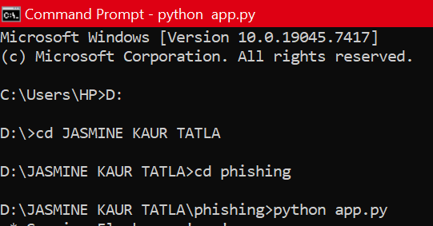
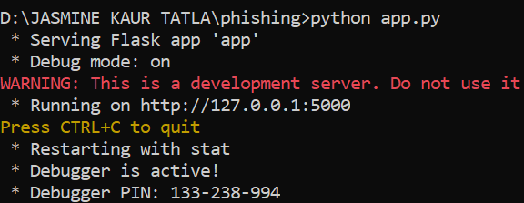
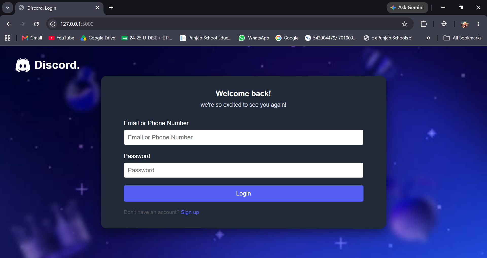
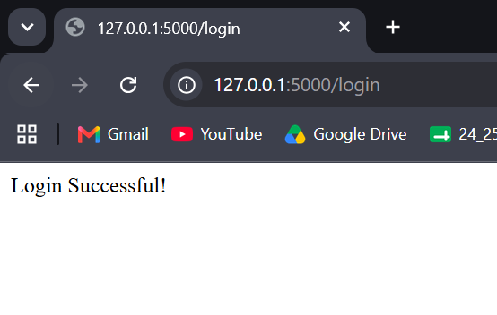
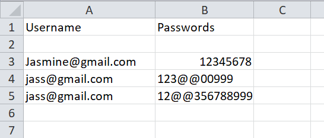

# discord_phishing_website
creating a fake website link to steal user credential (like username and password) for learning purpse and it saves the data in a CSV file.

# what is Phishing
Phishing is a cyberattack in which an attacker pretends to be a trusted person or organization to trick victims into revealing sensitive information such as:

Usernames and passwords
- Credit/debit card details
- Bank account information
- One-Time Passwords (OTPs)
- Personal information

The attacker usually impersonates a legitimate company, bank, government agency, or even someone the victim knows.

How phishing works
1. The attacker sends a fake email, SMS, social media message, or creates a fake website.
2. The message appears to come from a trusted source.
3. It asks the victim to click a link, open an attachment, or provide confidential information.
4. If the victim does so, the attacker steals the information or installs malware on the victim's device.

# structure of the project

discord_phishing_website
|---app.py
|---users.csv
|---templates/
|      |---index.html
|---static/
|      |---background.jfif
|      |---logo.png
|      |---style.css

## working 

# step 1. running app.py
open CMD and go to app.py file folder and write this command
```bash
python app.py
```

# step 2. opening webpage
 now from the output of the command that we have just run

 

 now copy the url given and open it in chrome

 
 
now for refrence i will show you the real discord webite side by side


 # step 3. login in the website
 now enter any random username and password

 

 then a successful login msg will appear

 

 # step 4. saved credentials
  now that we have the user credentials we have used CSV file to save those and easily access them 
 open users.csv file
  
 

 
